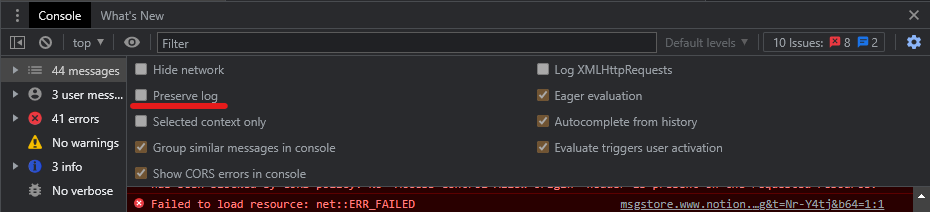
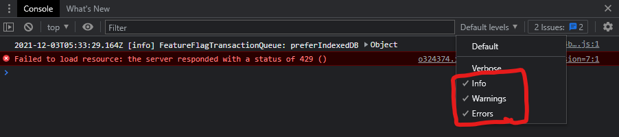
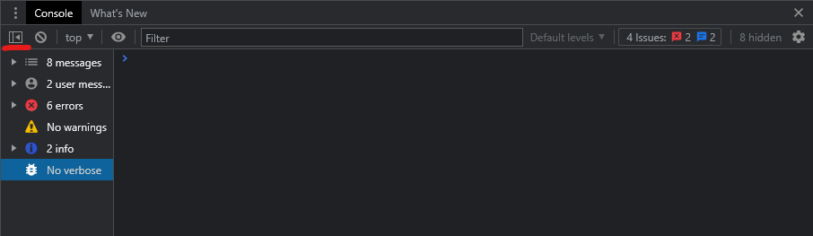
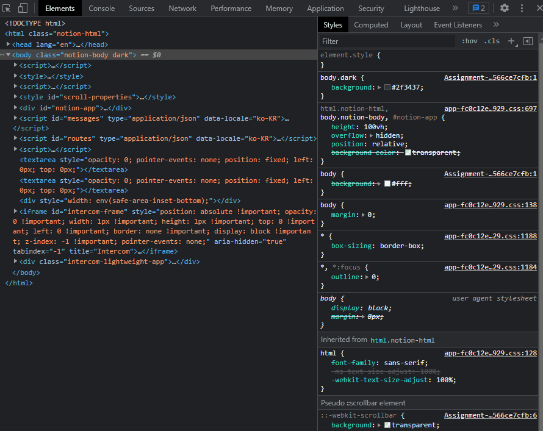

# 개발자도구

## 1. Console 패널

### 1-1. Console 패널의 기능

- `console.log()`를 이용해서 디버깅
- 자바스크립트 코드 실시간 작성 및 실행
- 프로그램의 `warning`, `error`, `info` 등 확인

### 1-2. 화면을 새로고침해도 Console 내용이 지워지지 않도록 하는 방법

- Console 패널의 오른쪽 상단의 톱니바퀴 클릭 ➡ `Preserve log` 체크

### 1-3. Console의 기록을 모두 지우는 메소드

> `Console.clear()` 또는 `clear()`를 Console에 입력

- 단, `Preserve log`가 체크되어 있을 때는 사용 불가

### 1-4. 콘솔에서 `Warnings`와 `Errors` 제외

- 방법 1.  Console 패널의 오른쪽 상단의 `Default levels` 클릭 ➡ `Warnings`와 `Errors` 체크 해제

- 방법 2. Console 패널 왼쪽의 메뉴 이용

### 1-5. 다른 패널에서 Console 패널을 같이 보는 방법

> Esc 키 누르기

