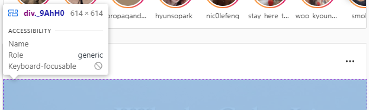

# 개발자도구

## 1. Elements 패널

### 1-1. Elements 패널의 기능

- 웹페이지의 전체적인 구조 확인
- `css` 디자인 확인

### 1-2. [해당 페이지](https://hyunseob.github.io/resume/)의 `section` 개수


- 5개

### 1-3. [인스타그램](https://www.instagram.com/) 피드의 가로 길이



- 624px

### 1-4. `style`의 순서의 의미

- 가장 상위태그인 `html` 내부의 인라인 스타일 ➡ id ➡ class ➡ tag 순으로 배치
- 우선순위가 가장 높은 것부터 `style` 적용

### 1-5. `user agent stylesheet`

> 사용자 도구 스타일시트

- 브라우저에서 기본적으로 적용되어 있는 표준 `stylesheet`
- 웹 브라우저마다 `default sheet`가 다르며 스타일시트에서는 가장 아래에 위치(가장 낮은 우선순위)
- 작성자가 필요에 따라 수정하는 경우가 많으며 우선순위에 따라 작성자가 쓴 스타일시트가 앞서 적용된다

## 2. Console 패널

### 2-1. Console 패널의 기능

- `console.log()`를 이용해서 디버깅
- 자바스크립트 코드 실시간 작성 및 실행
- 프로그램의 `warning`, `error`, `info` 등 확인

### 2-2. 화면을 새로고침해도 Console 내용이 지워지지 않도록 하는 방법


- Console 패널의 오른쪽 상단의 톱니바퀴 클릭 ➡ `Preserve log` 체크

### 2-3. Console의 기록을 모두 지우는 메소드

> `Console.clear()` 또는 `clear()`를 Console에 입력

- 단, `Preserve log`가 체크되어 있을 때는 사용 불가

### 2-4. 콘솔에서 `Warnings`와 `Errors` 제외

- 방법 1. Console 패널의 오른쪽 상단의 `Default levels` 클릭 ➡ `Warnings`와 `Errors` 체크 해제


- 방법 2. Console 패널 왼쪽의 메뉴 이용


### 2-5. 다른 패널에서 Console 패널을 같이 보는 방법

> Esc 키 누르기


## 3. Network 패널

### 3-1. Network 패널의 기능

- http 네트워크 통신 확인
- 페이지 로딩 성능 테스트
- 이미지, 영상 등 소스 검색

### 3-2. Network 패널의 여러가지 탭의 종류와 기능


> 여러가지 탭 중에서 가장 중요한 것은 **XHR**

- XHR(XML Http Request)
  - 브라우저와 서버가 HTTP 통신을 할 때 request 전문이 어떻게 구성되어 서버로 전달되는지 또는 request에 대한 서버로부터의 response 결과를 확인할 때 사용
  - AJAX 요청을 생성하는 JS API
  - 브라우저가 가지고 있는 `XMLHttpRequest(XHR)` 객체를 이용해서 전체 페이지를 새로고침하지 않아도 페이지의 일부만을 위한 데이터를 로드하는 기능(AJAX)

### 3-3. [마켓컬리](https://www.kurly.com/shop/main/index.php)의 카테고리 정보를 가져오는 API


- `Fetch/XHR` 탭 참조

### 3-4. [Tesla](https://www.tesla.com/ko_kr)의 신나게 달리는 자동차 영상 url 가져오기


- `Media` 탭 참조


## 4. Application 패널

### 4-1. Application 패널의 기능

- 브라우저 저장소 확인
  - `Local Storage`
  - `Session Storage`
  - `Cookie`
- 현재 로딩된 웹페이지에서 사용된 리소스(이미지, 스크립트, 데이터 등) 열람

### 4-2. `Local Storage`, `Session Storage`, `Cookie`의 차이점과 사용 예시

- `Cookie`는 데이터가 자동 전송되지만, `Local Storage`와 `Session Storage`에는 데이터를 선택하여 전송 가능
- `Cookie`는 만료기간 설정이 가능하며 `Local Storage`와 `Session Storage`에는 만료기간이 없다.
- 용량에 차이가 있다.

#### 1. `Local Storage`

- 같은 웹사이트를 여러 탭 또는 창에 띄울 때 데이터가 공유된다.

- 같은 컴퓨터에서 다른 브라우저를 사용하는 경우에는 공유되지 않는다.

- 탭이나 창을 닫아도 브라우저에 데이터가 남아 있다.

- `Local Storage`에 저장된 데이터에는 만료기간이 없고, 필요할 때는 언제든지 사용이 가능하다.

  예) 자동 로그인 등

#### 2. `Session Storage`

- 같은 웹사이트를 여러 탭 또는 창에 띄울 때 서로 데이터가 공유되지 않으며 각 탭이나 창이 닫힐 때 데이터도 함께 소멸

- 브라우저가 닫히면 데이터가 삭제되며, `refresh token` 이용 시 `session`에서 `token`정보 유지 가능

  예) 폼 입력 정보, 글쓰기 도중 사용자가 창을 벗어난 경우에 작성 내용 백업, 비회원 장바구니 등

#### 3. `Cookie`

- 서버 접속시 자동으로 데이터가 송신되어 서버와 로컬에 저장된다.
- 만료기한이 있는 키-값 저장소
- HTTP 요청을 보낼 때 서버는 요청 자체만으로는 누구에게서 오는 요청인지 알 수 없기 때문에 서버-클라이언트간 지속적인 데이터 교환을 위해 서버로 계속 데이터 전송
- 최대 4kb 용량 제한이 있고, 서버가 요청할 때마다 쿠키가 전송되므로 계속될 경우 데이터 낭비 발생 가능
- 사용 예시 - 팝업에서 "더 이상 안 보기" 체크, 비로그인 장바구니 저장 기능

#### 4. `Local Storage`와 `Session Storage`의 공통점

- 데이터를 브라우저 상에 저장
- JS API가 완전히 동일한 형태

#### 5. `Local Storage`와 `Session Storage`의 차이점

- 데이터의 보존 기간 (데이터의 영구성)이 다르다.

### 4-3. `Local Storage`에 특정 데이터를 저장하고 가져오는 방법

- 데이터 저장하기: `localStorage.setItem(key, value);`

- 데이터 불러오기: `localStorage.getItem(key);`

- 데이터 삭제: `localStorage.removeItem(key);`

- 모두 삭제: `localStorage.clear();`

- index값에 해당하는 키 가져오기: `localStorage.key(index);`

- 저장된 항목의 수: `localStorage.length`

- 예시

  - 저장: `objArr = [{num:1, title:'test', contents:'blahblah'}, ...]`

  - 키와 값 전체 불러오기

    ```javascript
    for(let i=0; i<localStorage.length; i++) {
        let key = localStorage.key(i); alert(`${key}: ${localStorage.getItem(key)}`);
    }
    ```

    
